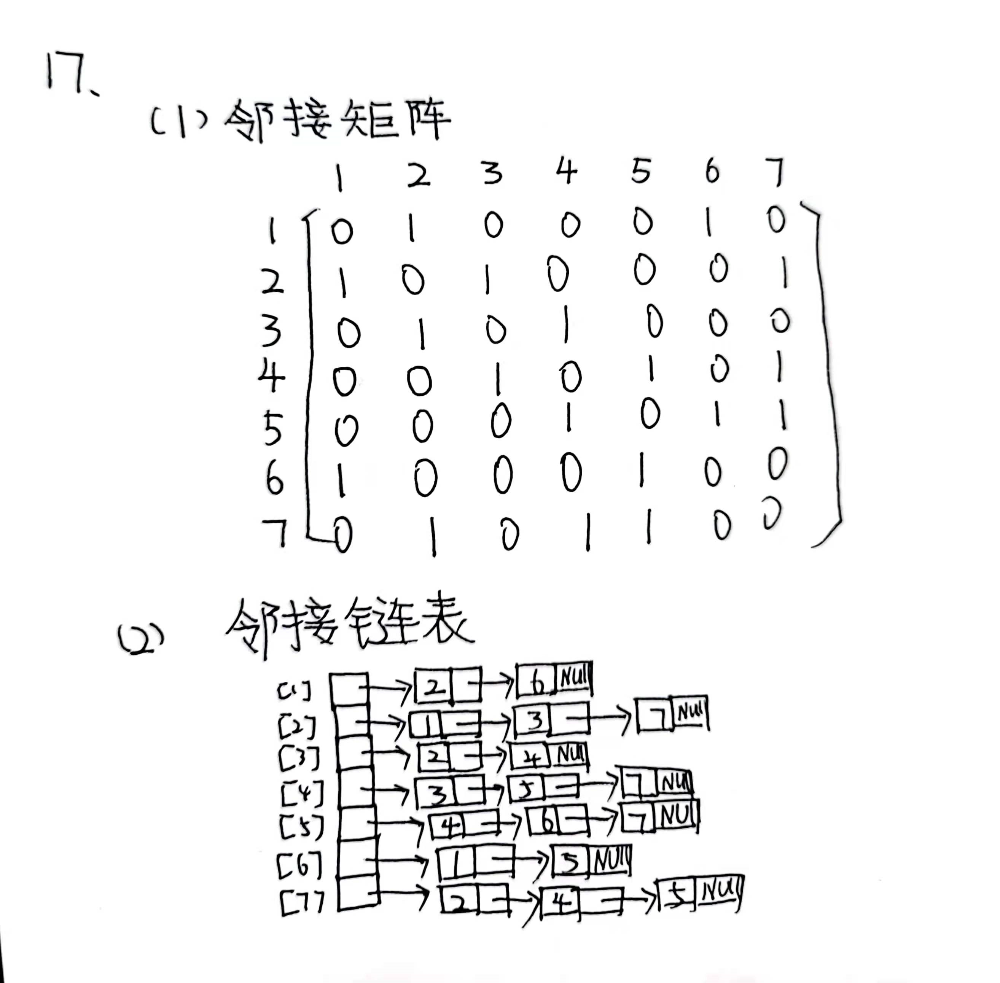
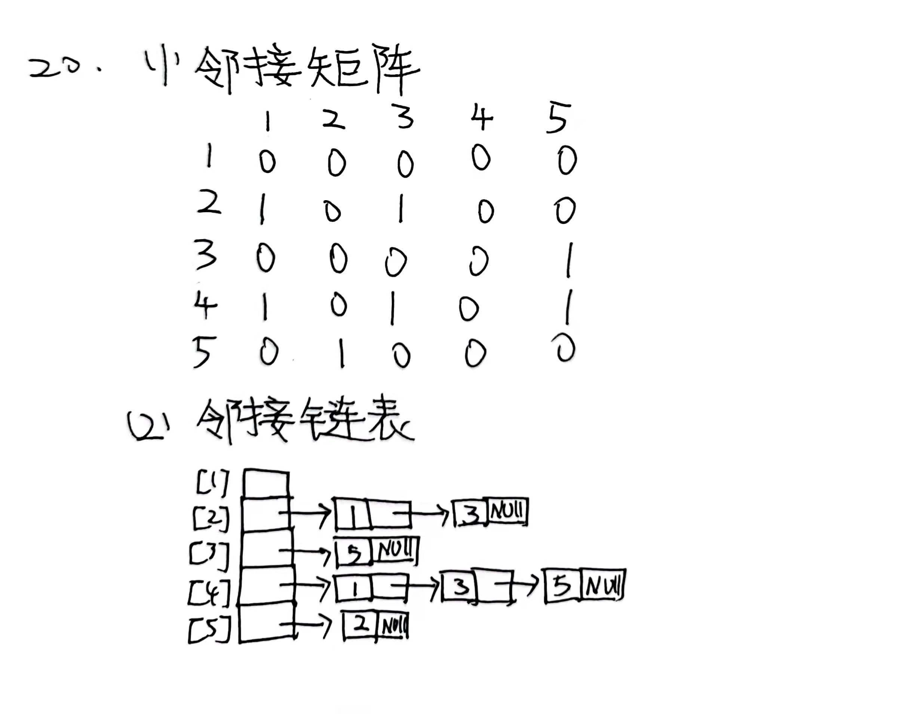
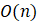
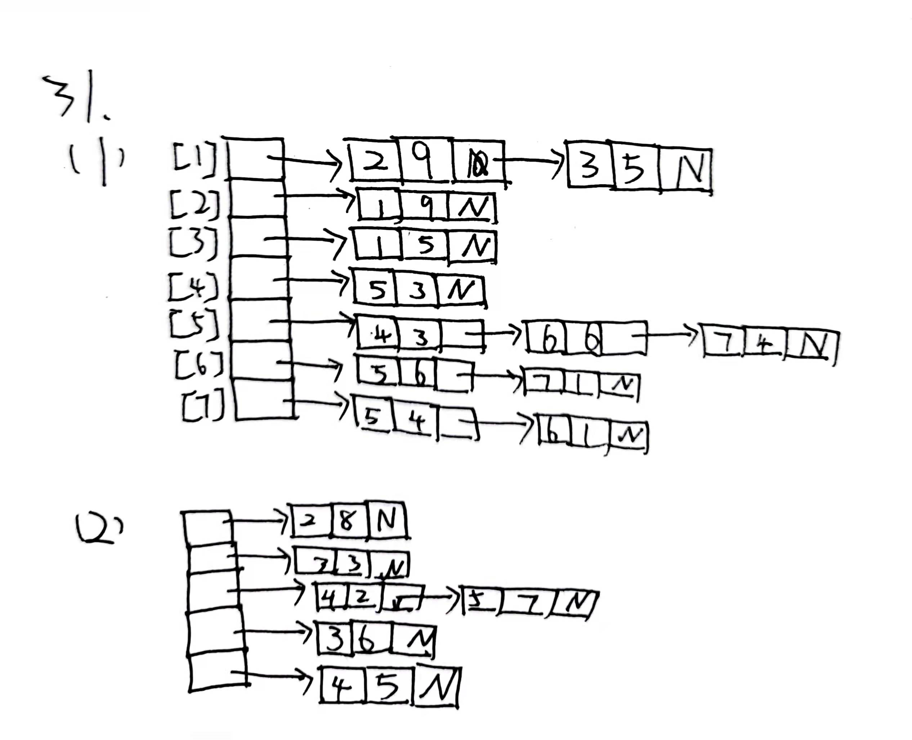
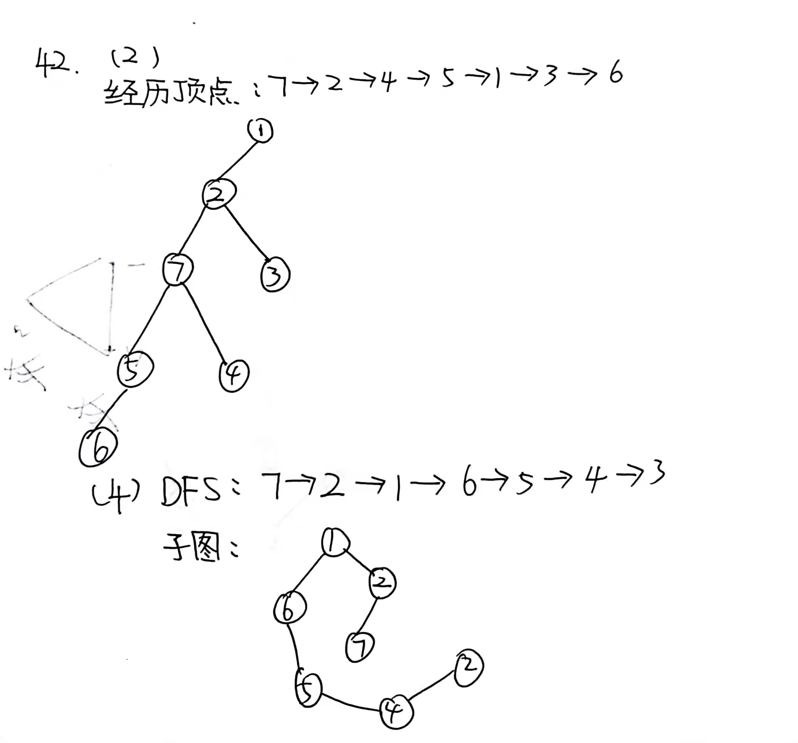
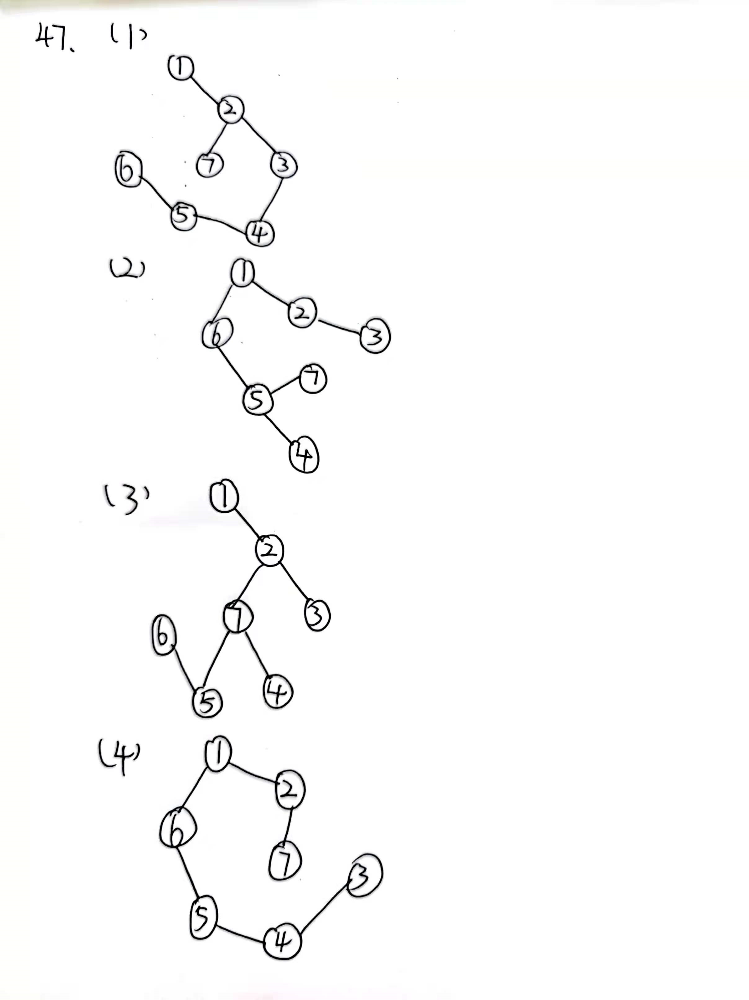

# 17题




# 20题




#  26题

(1)

```c++
void eraseEdge(int i, int j)
{
 	int oldE = e;
 	linkedWDigraph<T>::eraseEdge(i, j);//调用临接矩阵函数删除
}

```


(2)

```c++
void insertEdge(edge<T> *theEdge)
{
 	int oldE = e;
 	linkedWDigraph<T>::insertEdge(theEdge);//调用临接矩阵函数插入
}

```


# 27题

(1)

```c++
void eraseEdge(int i, int j)
{
    CheckEdge(i,j);//检查是否合法
    wEdge<T> *v = aList[i].eraseElement(j);
    if (!v)//如果成功删除，那么边数-1
    {
        e--;
    }	 
}

```

时间复杂度：


(2)

```c++
void insertEdge(edge<T> *theEdge)
{
	 int v1 = theEdge->vertex1();
	 int v2 = theEdge->vertex2();
	 if (aList[v1].indexOf(wEdge<T>(v2)) == -1) //没有边
	 {
	    aList[v1].insert(0, wEdge<T>(v2, theEdge->weight()));
	    e++;//边数自增
	 }
}

```

时间复杂度：


# 31题



# 42题



# 43题


```c++
void dfs(int v, int reach [], int label)
{
	 graph<T>::reach = reach;
	 graph<T>::label = label;
	 rDfs(v);
}

void rDfs(int v)
{
    if(reach[v])//判断是否来过
    {
    	return;    
    }
	 reach[v] = label;//标记
	 Iterator<T> *i= iterator(v);
	 while ((int u = i->next()) != 0)//当它还有相邻顶点
     {
         rDfs(u);
     }      
	 delete i;//释放
    i=nullptr;//指向null
}

```


```c++
void dfs(int v, int reach [], int label)
{
	 linkedDigraph<T>::reach = reach;
	 linkedDigraph <T>::label = label;
	 rDfs(v);
}

void rDfs(int v)
{
    if(reach[v])//判断是否来过
    {
    	return;    
    }
	 reach[v] = label;//标记
	 Iterator<T> *i= iterator(v);
	 while ((int u = i->next()) != 0)//当它还有相邻顶点
     {
         rDfs(u);
     }      
	 delete i;//释放
    i=nullptr;//指向null
}

```


# 47题




# 50题

(1)可以利用bfs实现拓扑排序，如果最后退出时候仍然有入度不为0的点，那么就有环

但是拓扑排序需要满足的是有向的。本题要求的是无方向的。打ACM时候遇到过类似的，我们用三种颜色标记即可。我们规定结点有三种颜色，白色、灰色、黑色，在结点没有访问之前，为白色，当结点入队时，结点变灰，出队时变黑。

```c++
bool Cycle(int s){
    for(int i = 1; i <= N; i++) 
    {
        nodesColor[i] = colorWhite;//没被访问过
    }
    queue<int> Q;
    Q.push(s);
    while(!Q.empty()){ //非空
        int v = Q.front();
        Q.pop();
        nodesColor[v] = colorGray;//标记，如果下一次访问的结点碰到了灰色，那么就有环
        for(int index = 0; index < Graph[v].size(); index++){
            int w = Graph[v][index];
            if(nodesColor[w] == colorWhite){
                Q.push(w);
                nodesColor[w] = colorGray;
            }else if(nodesColor[w] == colorGray){
                    return true;
            }
        }
        nodesColor[v] = colorBlack;
    }

    return false;
 
}
```

(2)dfs

将bfs转换为dfs

```c++
bool dfsCycle(int v){
	if (nodeColor[v]==colorGray)//如果访问到了灰色结点，就有环路
    {
        return true;
    }
    for(int index = 0; index < Graph[v].size(); index++){
        bool flag=false;//先标记为无环
        int w = Graph[v][index];
        if(nodesColor[w] == colorWhite)
        {
           	flag=flag||dfsCycle(v);//如果它临接的顶点有环，那么标记为true
            nodesColor[w] = colorGray;//标记为灰
        }
    }
	return flag;//返回是否有环
}
```

