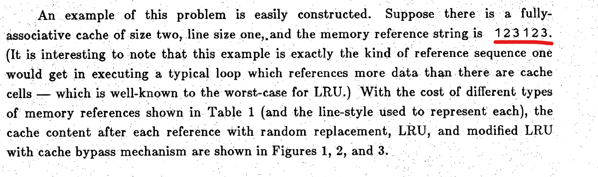
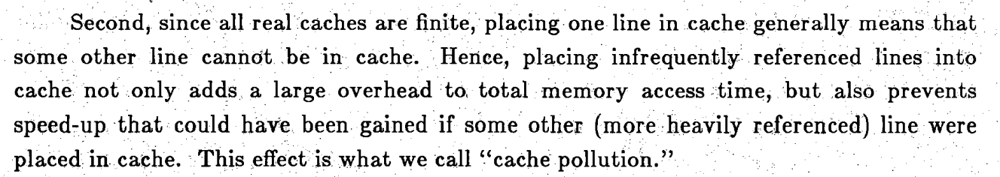
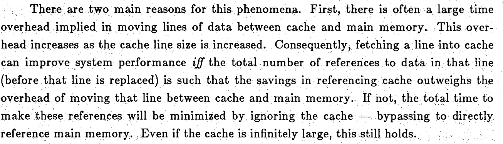
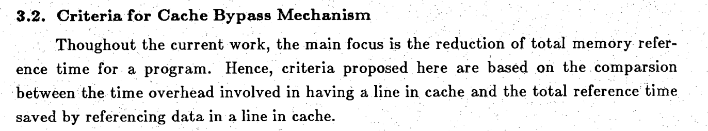
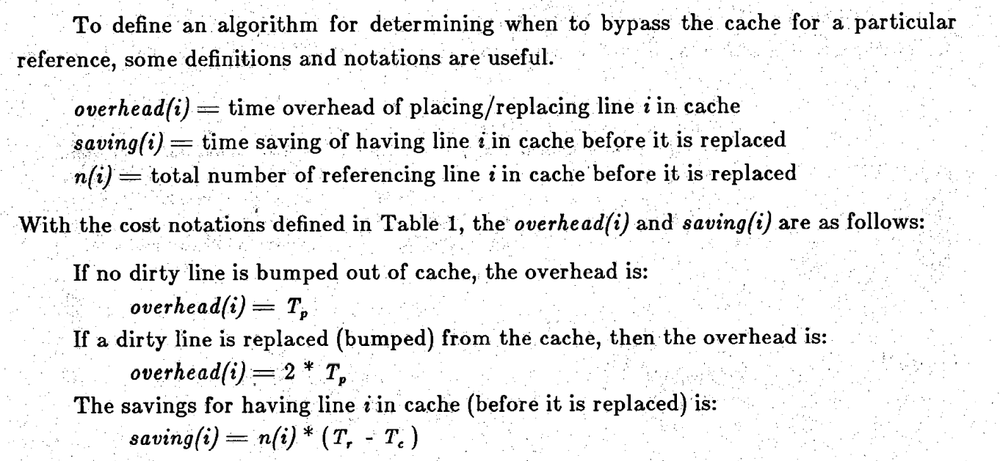
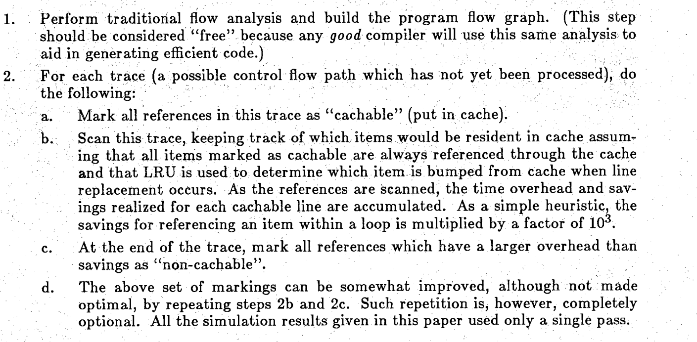

`writer :20.4 隋春雨`
首先：让我们看一下实验的要求，建议看英文原版的，中文翻译的有问题：
[实验要求](https://safari.ethz.ch/architecture/fall2020/lib/exe/fetch.php?media=lab1_assignment_2020.pdf)


主要的要求就是，让你设计一个正确的`data cache`和`instruction cache `

参考文章：
https://arxiv.org/pdf/2112.06989.pdf

我们需要设计`cache`替换算法，我看到有一篇paper的思路很有意思，链接如下：
https://docs.lib.purdue.edu/cgi/viewcontent.cgi?article=1621&context=ecetr


我们都知道，CPU访问cache的时间和访问内存的时间不是一个数量级，因此我们的优化目标就是最小化访问内存的时间。在我们

过去的思路中，是不是如果cache miss的话，就会从内存【CPU给出的地址对应的块】中调【所在块】到cache中，paper提出了这么一个问题：我们从内存中调一个块到cache中的花费也不少，如果被调入的这个块中的数据在一段时间内不会被用到，那么我们直接访存即可。不需要将所在的块放入cache，并且给了一个非常common 的一个例子 1 2 3 4  1 2 3 4 ，如果是普通的LRU就会hit rate =0。所以paper提出来了一个新的目标，对于我们认为的，将来一段时间内不会被用到的数据，就直接从内存送给CPU,不用放入cache。这就是paper 提出来的`selective Cache bypass`


# 实验的基础部分

​																							cache .h

```c++
#ifndef _CACHE_H_
#define _CACHE_H_
// lru frequency  int // 10
//v tag data frequency按字（4Byte）寻址 按使用频率替换
//存储使用的频率
//cache大小
#define INSTRUCTION_CACHE_SIZE 0x2000
#define DATA_CACHE_SIZE 0x10000
//（路数）每组的cache行数
#define INSTRUCTION_CACHE_WAYS 4
#define DATA_CACHE_WAYS 8
//cache块大小
#define INSTRUCTION_CACHE_BLOCK_SIZE 32
#define DATA_CACHE_BLOCK_SIZE 32
//cache组数
#define INSTRUCTION_CACHE_SET_NUMBER
INSTRUCTION_CACHE_SIZE/INSTRUCTION_CACHE_WAYS/INSTRUCTION_CACHE_BLOCK_SIZE
    
    
#define DATA_CACHE_SET_NUMBER DATA_CACHE_SIZE/DATA_CACHE_WAYS/DATA_CACHE_BLOCK_SIZE

// 主存空间
#define MEM_DATA_START  0x10000000
#define MEM_DATA_SIZE   0x00100000
#define MEM_TEXT_START  0x00400000
#define MEM_TEXT_SIZE   0x00100000

#include "shell.h"
#include <assert.h>
#include <stdio.h>
#include <stdlib.h>
#include <string.h>
#include <stdint.h>

typedef struct
{
    uint8_t frequency; //根据每组的cache行数确定位数，每组n行，需要2^n位
    BOOL v;            //1bit的有效位
    BOOL changed;       //考虑多进程情况，1表示这个引用内存的块被修改了
    uint32_t tag;      //内存标志
    // uint32_t data[8];    //不定长的数组，取决于总的cache块的大小
    uint8_t data[32];    //不定长的数组，取决于总的cache块的大小
} cacheBlock;

typedef struct
{

    int Size;           //总的大小 8kB 64kB
    int setNumber;      //多少组 Size/blockSize/ways 64 256
    int blockSize;      //cache行的大小 32byte
    int ways;           //每组几个 取指：4 访存：8
    cacheBlock *header; //cacheBlock数组

/*解析内存  
    PC [10:0]       PC[10:5]组的索引  PC[4:2]块内偏移 PC[1:0]一个字
    PC [31:11]      PC[31:11] tag

    Address [12:0]  Address[12:5] Address[4:2]块内偏移 Address[1:0]一个字
    Address [31:13] tag
*/
} cache;


#define CACHE_NREGIONS (sizeof(CACHE_REGIONS)/sizeof(cache))


// cache instructionCache = {
//     (cacheBlock *)malloc(INSTRUCTION_CACHE_SET_NUMBER * sizeof(cacheBlock)),
//     INSTRUCTION_CACHE_SIZE,
//     INSTRUCTION_CACHE_SET_NUMBER,
//     INSTRUCTION_CACHE_BLOCK_SIZE,
//     INSTRUCTION_CACHE_WAYS};
// cache dataCache = {
//     (cacheBlock *)malloc(DATA_CACHE_SET_NUMBER * sizeof(cacheBlock)),
//     DATA_CACHE_SIZE,
//     DATA_CACHE_SET_NUMBER,
//     DATA_CACHE_BLOCK_SIZE,
//     DATA_CACHE_WAYS};

uint32_t cache_read_32(uint32_t address);
void cache_write_32(uint32_t address, uint32_t value);
void init_cache();
void delete_cache();
#endif
```


​																								cache.c

```c++
#include <stdlib.h>
#include "cache.h"
#include "shell.h"
extern int locked = -1;//不堵塞
cache INSTRUCTION_CACHE =
        {

                INSTRUCTION_CACHE_SIZE,
                INSTRUCTION_CACHE_SET_NUMBER,
                INSTRUCTION_CACHE_BLOCK_SIZE,
                INSTRUCTION_CACHE_WAYS,
                NULL
        };
cache DATA_CACHE=
        {
                DATA_CACHE_SIZE,
                DATA_CACHE_SET_NUMBER,
                DATA_CACHE_BLOCK_SIZE,
                DATA_CACHE_WAYS,
                NULL
        };

// void changeLRU(int i)
// {

// }

/*
LRU策略：
LRU为 0 - 7  参考文章： https://arxiv.org/pdf/2112.06989.pdf
初始化时，将LRU置为 7
这样，我们的替换方式可以统一为将 LRU == 7 的缓存块替换
*/


/***************************************************************/
/*                                                             */
/* Procedure: cache_read_32                                    */
/* writer:scy                                                */
/* Purpose: Read a 32-bit word from cache                      */
/*                                                             */
/***************************************************************/
uint32_t cache_read_32(uint32_t address)
{
        if (locked>0)
    {
        return;             //仍在阻塞
    }
    if (address >= MEM_DATA_START && address < MEM_DATA_START + MEM_DATA_SIZE)//如果在数据区
    {
        // 解析地址
        uint8_t offset = address & 0x1f;           // 0 -- 31
        uint8_t SetsIndex = (address >> 5) & 0xff; // 0 -- 255
        uint32_t tag = (address >> 13) & 0x7ffff;
        BOOL FLAG = 0;//是否找到了

        // cache组首地址
        int SetStart = (int)SetsIndex * DATA_CACHE_WAYS;

        int i;
        for (i = 0; i < DATA_CACHE_WAYS; i++)
        {   //这个不用防止短路
            if (DATA_CACHE.header[SetStart + i].v == 1 && DATA_CACHE.header[SetStart + i].tag == tag)
            {
                FLAG = 1; // 命中

                //change LRU
                int j;
                for (j = 0; j < DATA_CACHE_WAYS; j++)
                {
                    if (DATA_CACHE.header[SetStart + j].frequency < DATA_CACHE.header[SetStart + i].frequency)
                    {
                        DATA_CACHE.header[SetStart + j].frequency++;
                    }
                }
                DATA_CACHE.header[SetStart + i].frequency = 0;

                return (DATA_CACHE.header[SetStart + i].data[offset + 3] << 24) |
                       (DATA_CACHE.header[SetStart + i].data[offset + 2] << 16) |
                       (DATA_CACHE.header[SetStart + i].data[offset + 1] << 8) |
                       (DATA_CACHE.header[SetStart + i].data[offset + 0] << 0);
            }
        }

        // Miss
        if (!FLAG)
        {
            if (locked==0)
            {
                locked = -1;        //阻塞结束，继续运行
            }
            else {
                locked = 50;        //说明应该开始阻塞
            }
            
            uint32_t value = mem_read_32(address);
            for (i = 0; i < DATA_CACHE_WAYS; i++)
            {
                // 根据最近最少用原则在组内寻找frequency == 7的替换块
                if (DATA_CACHE.header[SetStart + i].frequency == 7)
                {
                    // 写回改变过且不是空cache
                    if (DATA_CACHE.header[SetStart + i].changed == 1 && DATA_CACHE.header[SetStart + i].v == 1)
                    {
                        uint32_t source_address;
                        int j;
                        
                        for(j = 0; j < 8; j++){
                            source_address = ((DATA_CACHE.header[SetStart + i].tag << 13) & 0xFFFFE000) |
                                             ((SetsIndex << 5) &  0x1FE0)|
                                             ((j << 2) & 0x1C);
                            mem_write_32(source_address , 
                                        (DATA_CACHE.header[SetStart + i].data[j * 4 + 3] << 24) |
                                        (DATA_CACHE.header[SetStart + i].data[j * 4 + 2] << 16) |
                                        (DATA_CACHE.header[SetStart + i].data[j * 4 + 1] << 8) |
                                        (DATA_CACHE.header[SetStart + i].data[j * 4 + 0] << 0)
                                        );
                        }
                        DATA_CACHE.header[SetStart + i].changed = 0;
                        DATA_CACHE.header[SetStart + i].v = 0;
                    }
                    /* 完整读入读入应读入的cache行 */
                    uint32_t source_address;
                    int j;
                    for(j = 0; j < 8; j++){
                        source_address = (address & 0xFFFFFFE0) |
                                         ((j << 2) & 0x1C );
                        uint32_t result =mem_read_32(source_address);
                        DATA_CACHE.header[SetStart + i].data[j * 4 + 3] = (result >> 24) & 0xFF;
                        DATA_CACHE.header[SetStart + i].data[j * 4 + 2] = (result >> 16) & 0xFF;
                        DATA_CACHE.header[SetStart + i].data[j * 4 + 1] = (result >> 8) & 0xFF;
                        DATA_CACHE.header[SetStart + i].data[j * 4 + 0] = (result >> 0) & 0xFF;
                    }    

                    DATA_CACHE.header[SetStart + i].v = 1;
                    DATA_CACHE.header[SetStart + i].tag = tag;

                    //change LRU
                    for (j = 0; j < DATA_CACHE_WAYS; j++)
                    {
                        if (DATA_CACHE.header[SetStart + j].frequency != 7)
                        {
                            DATA_CACHE.header[SetStart + j].frequency++;
                        }
                    }
                    DATA_CACHE.header[SetStart + i].frequency = 0;      // 7 -> 0
                    break;
                }
            }

            return value;
        }
    }
    /*************************************************************************************/
    else if (address >= MEM_TEXT_START && address < MEM_TEXT_START + MEM_TEXT_SIZE)
    {
         // 解析地址
        uint8_t offset = address & 0x1f;           // 0 -- 31
        uint8_t SetsIndex = (address >> 5) & 0x3f; // 0 -- 63
        uint32_t tag = (address >> 11) & 0x1ffff;
        BOOL FLAG = 0;

        int SetStart = (int)SetsIndex * INSTRUCTION_CACHE_WAYS;

        int i;
        for (i = 0; i < INSTRUCTION_CACHE_WAYS; i++)
        {
            if (INSTRUCTION_CACHE.header[SetStart + i].v == 1 && INSTRUCTION_CACHE.header[SetStart + i].tag == tag)
            {
                FLAG = 1; // 命中

                //change LRU
                int j;
                for (j = 0; j < INSTRUCTION_CACHE_WAYS; j++)
                {
                    if (INSTRUCTION_CACHE.header[SetStart + j].frequency < INSTRUCTION_CACHE.header[SetStart + i].frequency)
                    {
                        INSTRUCTION_CACHE.header[SetStart + j].frequency++;
                    }
                }
                INSTRUCTION_CACHE.header[SetStart + i].frequency = 0;

                return (INSTRUCTION_CACHE.header[SetStart + i].data[offset + 3] << 24) |
                       (INSTRUCTION_CACHE.header[SetStart + i].data[offset + 2] << 16) |
                       (INSTRUCTION_CACHE.header[SetStart + i].data[offset + 1] << 8) |
                       (INSTRUCTION_CACHE.header[SetStart + i].data[offset + 0] << 0);
            }
        }

        // Miss
        if (!FLAG)
        {
            if (locked==0){
                locked = -1;        //阻塞结束，继续运行
            }else {
                locked = 50;        //说明应该开始阻塞
            }
            uint32_t value = mem_read_32(address);
            for (i = 0; i < INSTRUCTION_CACHE_WAYS; i++)
            {
                // frequency == 3: 空闲 或 最近最少用
                if (INSTRUCTION_CACHE.header[SetStart + i].frequency == 3)
                {
                    //改变过且不是空cache
                    if (INSTRUCTION_CACHE.header[SetStart + i].changed == 1 && INSTRUCTION_CACHE.header[SetStart + i].v == 1)
                    {
                        uint32_t source_address;
                        int j;
                        
                        for(j = 0; j < 8; j++){
                            source_address = ((INSTRUCTION_CACHE.header[SetStart + i].tag << 11) & 0xFFFFF800) |
                                             ((SetsIndex << 5) &  0x7E0)|
                                             ((j << 2) & 0x1C);
                            mem_write_32(source_address , 
                                        (INSTRUCTION_CACHE.header[SetStart + i].data[j * 4 + 3] << 24) |
                                        (INSTRUCTION_CACHE.header[SetStart + i].data[j * 4 + 2] << 16) |
                                        (INSTRUCTION_CACHE.header[SetStart + i].data[j * 4 + 1] << 8) |
                                        (INSTRUCTION_CACHE.header[SetStart + i].data[j * 4 + 0] << 0)
                                        );
                        }
                        INSTRUCTION_CACHE.header[SetStart + i].changed = 0;
                        INSTRUCTION_CACHE.header[SetStart + i].v = 0;
                    }
                    /* 完整读入读入应读入的cache行 */
                    uint32_t source_address;
                    int j;
                    for(j = 0; j < 8; j++){
                        source_address = (address & 0xFFFFFFE0) |
                                         ((j << 2) & 0x1C );
                        uint32_t result = mem_read_32(source_address);
                        INSTRUCTION_CACHE.header[SetStart + i].data[j * 4 + 3] = (result >> 24) & 0xFF;
                        INSTRUCTION_CACHE.header[SetStart + i].data[j * 4 + 2] = (result >> 16) & 0xFF;
                        INSTRUCTION_CACHE.header[SetStart + i].data[j * 4 + 1] = (result >> 8) & 0xFF;
                        INSTRUCTION_CACHE.header[SetStart + i].data[j * 4 + 0] = (result >> 0) & 0xFF;
                    }    

                    INSTRUCTION_CACHE.header[SetStart + i].v = 1;
                    INSTRUCTION_CACHE.header[SetStart + i].tag = tag;

                    //change LRU
                    for (j = 0; j < INSTRUCTION_CACHE_WAYS; j++)
                    {
                        if (INSTRUCTION_CACHE.header[SetStart + j].frequency != 3)
                        {
                            INSTRUCTION_CACHE.header[SetStart + j].frequency++;
                        }
                    }
                    INSTRUCTION_CACHE.header[SetStart + i].frequency = 0;      // 3 -> 0
                    break;
                }
            }

            return value;
        }       
    }
}

/***************************************************************/
/*                                                             */
/* Procedure: cache_write_32                                   */
/*                                                             */
/* Purpose: Write a 32-bit word to memory (and cache)          */
/*                                                             */
/***************************************************************/

void cache_write_32(uint32_t address, uint32_t value)
{
    if (address >= MEM_DATA_START && address < MEM_DATA_START + MEM_DATA_SIZE)
    {
        // 解析地址
        uint8_t offset = address & 0x1f;           // 0 -- 31
        uint8_t SetsIndex = (address >> 5) & 0xff; // 0 -- 255
        uint32_t tag = (address >> 13) & 0x7ffff;   //发现这个可以使用计算器的程序员模式计算
        BOOL FLAG = 0;

        int SetStart = (int)SetsIndex * DATA_CACHE_WAYS;

        int i;
        for (i = 0; i < DATA_CACHE_WAYS; i++)
        {
            if (DATA_CACHE.header[SetStart + i].v == 1 && DATA_CACHE.header[SetStart + i].tag == tag)
            {
                FLAG = 1; // 命中
                //change LRU
                int j;
                for (j = 0; j < DATA_CACHE_WAYS; j++)
                {
                    if (DATA_CACHE.header[SetStart + j].frequency < DATA_CACHE.header[SetStart + i].frequency)
                    {
                        DATA_CACHE.header[SetStart + j].frequency++;
                    }
                }
                DATA_CACHE.header[SetStart + i].frequency = 0;
                // 数据写入cache，这一整行都变成了已修改状态
                DATA_CACHE.header[SetStart + i].data[offset + 3] = (value >> 24) & 0xFF;
                DATA_CACHE.header[SetStart + i].data[offset + 2] = (value >> 16) & 0xFF;
                DATA_CACHE.header[SetStart + i].data[offset + 1] = (value >> 8) & 0xFF;
                DATA_CACHE.header[SetStart + i].data[offset + 0] = (value >> 0) & 0xFF;

                DATA_CACHE.header[SetStart + i].changed=1;
            }
        }

        // Miss
        if (!FLAG)
        {
            // uint32_t value = mem_read_32(address);
            for (i = 0; i < DATA_CACHE_WAYS; i++)
            {
                // frequency == 7: 空闲 或 最近最少用
                if (DATA_CACHE.header[SetStart + i].frequency == 7)
                {
                    //改变过且不是空cache
                    if (DATA_CACHE.header[SetStart + i].changed == 1 && DATA_CACHE.header[SetStart + i].v == 1)
                    {
                        uint32_t source_address;
                        int j;
                        
                        for(j = 0; j < 8; j++){
                            source_address = ((DATA_CACHE.header[SetStart + i].tag << 13) & 0xFFFFE000) |
                                             ((SetsIndex << 5) &  0x1FE0)|
                                             ((j << 2) & 0x1C);
                            mem_write_32(source_address , 
                                        (DATA_CACHE.header[SetStart + i].data[j * 4 + 3] << 24) |
                                        (DATA_CACHE.header[SetStart + i].data[j * 4 + 2] << 16) |
                                        (DATA_CACHE.header[SetStart + i].data[j * 4 + 1] << 8) |
                                        (DATA_CACHE.header[SetStart + i].data[j * 4 + 0] << 0)
                                        );
                        }
                        DATA_CACHE.header[SetStart + i].changed = 0;
                        DATA_CACHE.header[SetStart + i].v = 0;
                    }
                    //这个之前的是不合理的，应该一次性读所有的8个数据,或者写8个数据。

                    /* 完整读入读入应读入的cache行 */
                    uint32_t source_address;
                    int j;
                    for(j = 0; j < 8; j++){
                        source_address = (address & 0xFFFFFFE0) |
                                         ((j << 2) & 0x1C );
                        uint32_t result = mem_read_32(source_address);
                        DATA_CACHE.header[SetStart + i].data[j * 4 + 3] = (result >> 24) & 0xFF;
                        DATA_CACHE.header[SetStart + i].data[j * 4 + 2] = (result >> 16) & 0xFF;
                        DATA_CACHE.header[SetStart + i].data[j * 4 + 1] = (result >> 8) & 0xFF;
                        DATA_CACHE.header[SetStart + i].data[j * 4 + 0] = (result >> 0) & 0xFF;
                    }    
                    DATA_CACHE.header[SetStart + i].tag = tag;

                    DATA_CACHE.header[SetStart + i].v = 1;
                    //设置脏位，并处理替换，替换出现在：写不命中，读不命中，程序结束，停用cache
                    //change LRU
                    for (j = 0; j < DATA_CACHE_WAYS; j++)
                    {
                        if (DATA_CACHE.header[SetStart + j].frequency != 7)
                        {
                            DATA_CACHE.header[SetStart + j].frequency++;
                        }
                    }
                    DATA_CACHE.header[SetStart + i].frequency = 0;

                    break;
                }
            }

        }
    }
    /*************************************************************************************/
    else if (address >= MEM_TEXT_START && address < MEM_TEXT_START + MEM_TEXT_SIZE)
    {
         // 解析地址
        uint8_t offset = address & 0x1f;           // 0 -- 31
        uint8_t SetsIndex = (address >> 5) & 0x3f; // 0 -- 63
        uint32_t tag = (address >> 11) & 0x1ffff;
        BOOL FLAG = 0;

        int SetStart = (int)SetsIndex * INSTRUCTION_CACHE_WAYS;

        int i;
        for (i = 0; i < INSTRUCTION_CACHE_WAYS; i++)
        {
            if (INSTRUCTION_CACHE.header[SetStart + i].v == 1 && INSTRUCTION_CACHE.header[SetStart + i].tag == tag)
            {
                FLAG = 1; // 命中
                //change LRU
                int j;
                for (j = 0; j < INSTRUCTION_CACHE_WAYS; j++)
                {
                    if (INSTRUCTION_CACHE.header[SetStart + j].frequency < INSTRUCTION_CACHE.header[SetStart + i].frequency)
                    {
                        INSTRUCTION_CACHE.header[SetStart + j].frequency++;
                    }
                }
                INSTRUCTION_CACHE.header[SetStart + i].frequency = 0;
                //数据写入cache，这一整行都变成了已修改状态
                INSTRUCTION_CACHE.header[SetStart + i].data[offset + 3] = (value >> 24) & 0xFF;
                INSTRUCTION_CACHE.header[SetStart + i].data[offset + 2] = (value >> 16) & 0xFF;
                INSTRUCTION_CACHE.header[SetStart + i].data[offset + 1] = (value >> 8) & 0xFF;
                INSTRUCTION_CACHE.header[SetStart + i].data[offset + 0] = (value >> 0) & 0xFF;

                INSTRUCTION_CACHE.header[SetStart + i].changed=1;
            }
        }

        // Miss
        if (!FLAG)
        {
            // uint32_t value = mem_read_32(address);
            for (i = 0; i < INSTRUCTION_CACHE_WAYS; i++)
            {
                // frequency == 3: 空闲 或 最近最少用
                if (INSTRUCTION_CACHE.header[SetStart + i].frequency == 3)
                {
                    //改变过且不是空cache
                    if (INSTRUCTION_CACHE.header[SetStart + i].changed == 1 && INSTRUCTION_CACHE.header[SetStart + i].v == 1)
                    {
                        uint32_t source_address;
                        int j;
                        
                        for(j = 0; j < 8; j++){
                            source_address = ((INSTRUCTION_CACHE.header[SetStart + i].tag << 13) & 0xFFFFE000) |
                                             ((SetsIndex << 5) &  0x1FE0)|
                                             ((j << 2) & 0x1C);
                            mem_write_32(source_address , 
                                        (INSTRUCTION_CACHE.header[SetStart + i].data[j * 4 + 3] << 24) |
                                        (INSTRUCTION_CACHE.header[SetStart + i].data[j * 4 + 2] << 16) |
                                        (INSTRUCTION_CACHE.header[SetStart + i].data[j * 4 + 1] << 8) |
                                        (INSTRUCTION_CACHE.header[SetStart + i].data[j * 4 + 0] << 0)
                                        );
                        }
                        INSTRUCTION_CACHE.header[SetStart + i].changed = 0;
                        INSTRUCTION_CACHE.header[SetStart + i].v = 0;
                    }
                    //这个之前的是不合理的，应该一次性读所有的8个数据,或者写8个数据。

                    /* 完整读入读入应读入的cache行 */
                    uint32_t source_address;
                    int j;
                    for(j = 0; j < 8; j++){
                        source_address = (address & 0xFFFFFFE0) |
                                         ((j << 2) & 0x1C );
                        uint32_t result = mem_read_32(source_address);
                        INSTRUCTION_CACHE.header[SetStart + i].data[j * 4 + 3] = (result >> 24) & 0xFF;
                        INSTRUCTION_CACHE.header[SetStart + i].data[j * 4 + 2] = (result >> 16) & 0xFF;
                        INSTRUCTION_CACHE.header[SetStart + i].data[j * 4 + 1] = (result >> 8) & 0xFF;
                        INSTRUCTION_CACHE.header[SetStart + i].data[j * 4 + 0] = (result >> 0) & 0xFF;
                    } 
                                      
                    INSTRUCTION_CACHE.header[SetStart + i].v = 1;

                    INSTRUCTION_CACHE.header[SetStart + i].tag = tag;

                    //设置脏位，并处理替换，替换出现在：写不命中，读不命中，程序结束，停用cache
                    //change LRU
                    for (j = 0; j < INSTRUCTION_CACHE_WAYS; j++)
                    {
                        if (INSTRUCTION_CACHE.header[SetStart + j].frequency != 3)
                        {
                            INSTRUCTION_CACHE.header[SetStart + j].frequency++;
                        }
                    }
                    INSTRUCTION_CACHE.header[SetStart + i].frequency = 0;
                    break;
                }
            }

        }
    }
    return;
}


/***************************************************************/
/*                                                             */
/* Procedure : init_cache                                     */
/*                                                             */
/* Purpose   : Allocate and zero cache                      */
/*                                                             */
/***************************************************************/

void init_cache()
{
    // 初始化指令cache
    int LineOfins = INSTRUCTION_CACHE.setNumber * INSTRUCTION_CACHE.ways;
    int LineOfdata = DATA_CACHE.setNumber * DATA_CACHE.ways;

    INSTRUCTION_CACHE.header = malloc(LineOfins * sizeof(cacheBlock));
    int i;
    for (i = 0; i < LineOfins; i++)
    {
        INSTRUCTION_CACHE.header[i].frequency = 3;
        INSTRUCTION_CACHE.header[i].v = 0;
        INSTRUCTION_CACHE.header[i].changed = 0;

        memset(INSTRUCTION_CACHE.header[i].data, 0, 32); //INSTRUCTION_CACHE.header[i].data +
    }
    // 初始化数据cache
    DATA_CACHE.header = malloc(LineOfdata * sizeof(cacheBlock));
    for (i = 0; i < LineOfdata; i++)
    {
        DATA_CACHE.header[i].frequency = 7;
        DATA_CACHE.header[i].v = 0;
        DATA_CACHE.header[i].changed = 0;

        memset(DATA_CACHE.header[i].data, 0, 32); //DATA_CACHE.header[i].data +
    }
}

void delete_cache()
{
    int LineOfins = INSTRUCTION_CACHE.setNumber * INSTRUCTION_CACHE.ways;
    int LineOfdata = DATA_CACHE.setNumber * DATA_CACHE.ways;
    int SetsIndex;
    int i,j;
    for (i = 0; i < LineOfdata; i++)
    {
        if(DATA_CACHE.header[i].v==1 && DATA_CACHE.header[i].changed==1){
            uint32_t source_address;
            SetsIndex = i / DATA_CACHE_WAYS;
            for (j = 0; j < 8; j++)//遍历块
            {
                source_address = ((DATA_CACHE.header[i].tag << 13) & 0xFFFFE000) |
                                ((SetsIndex << 5) & 0x1FE0) |
                                ((j << 2) & 0x1C);
                mem_write_32(source_address,
                            (DATA_CACHE.header[i].data[j * 4 + 3] << 24) |
                            (DATA_CACHE.header[i].data[j * 4 + 2] << 16) |
                            (DATA_CACHE.header[i].data[j * 4 + 1] << 8) |
                            (DATA_CACHE.header[i].data[j * 4 + 0] << 0));
            }
            DATA_CACHE.header[i].changed = 0;
            DATA_CACHE.header[i].v = 0;
        }
    }
    for (i = 0; i < LineOfins; i++)
    {
        if(INSTRUCTION_CACHE.header[i].v==1 && INSTRUCTION_CACHE.header[i].changed==1){
            uint32_t source_address;
            SetsIndex = i / INSTRUCTION_CACHE_WAYS;
            for (j = 0; j < 8; j++)//遍历块
            {
                source_address = ((INSTRUCTION_CACHE.header[i].tag << 13) & 0xFFFFE000) |
                                ((SetsIndex << 5) & 0x1FE0) |
                                ((j << 2) & 0x1C);
                mem_write_32(source_address,
                            (INSTRUCTION_CACHE.header[i].data[j * 4 + 3] << 24) |
                            (INSTRUCTION_CACHE.header[i].data[j * 4 + 2] << 16) |
                            (INSTRUCTION_CACHE.header[i].data[j * 4 + 1] << 8) |
                            (INSTRUCTION_CACHE.header[i].data[j * 4 + 0] << 0));
            }
            INSTRUCTION_CACHE.header[i].changed = 0;
            INSTRUCTION_CACHE.header[i].v = 0;
        }
    }
}
```


#  现有的替换策略


# 原来的策略的坏处




# cache pollution




# 极端情况下为什么现有的策略甚至不如没有cache





#  提出来的新的替换策略


# 替换算法与算法流程








